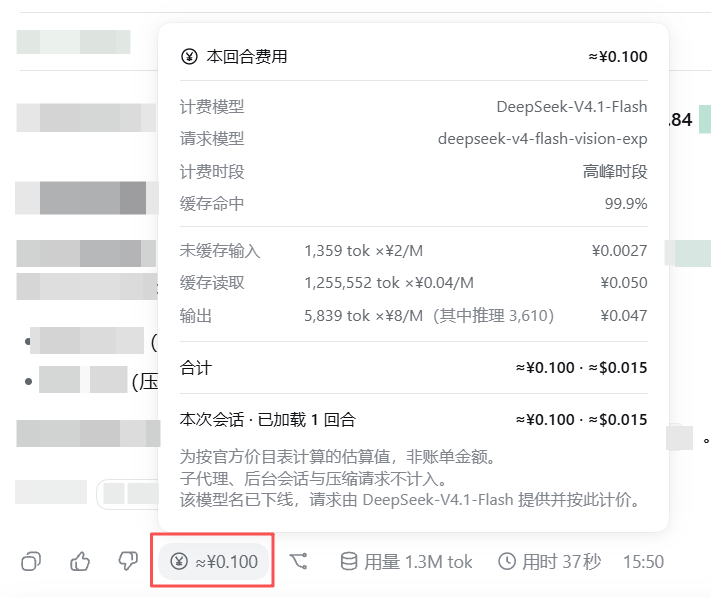
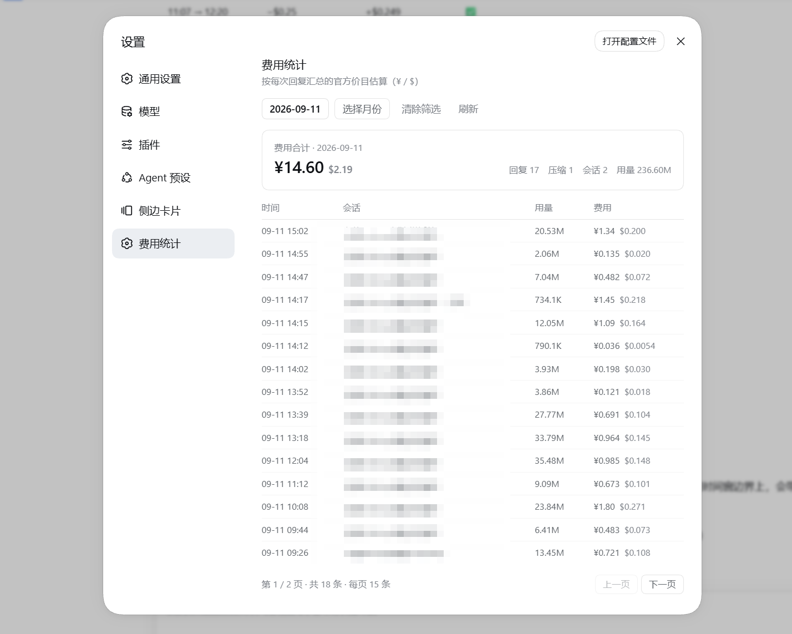

# dsh-cost-stats

<p>
  <a href="https://github.com/AGImentu/dsh-cost-stats/actions/workflows/ci.yml"></a>
  <a href="https://github.com/AGImentu/dsh-cost-stats/stargazers"></a>
  
  <a href="https://opensource.org/licenses/MIT"></a>
  
  
</p>

**在 DeepSeek Harness 的每条助手消息旁,显示这次对话花了多少钱。**

一个 DSH Web 插件:在消息尾行的原生「用量 612K tok」胶囊旁边,加一个 `≈¥0.709` 的费用胶囊;
点开可以看到这一次对话的分档明细、计费模型、高峰/空闲时段,以及本次会话的累计费用。
设置里还有一个**费用统计**页,把每一次计费项(回复 + 上下文压缩)列成流水。

> 数据来源与原生「用量」弹窗**完全同源**(供应商上报的 token 分档),不是估算 token 再套平均价;
> 价格用官方公布的两套价目表(人民币 + 美元),含旧模型名的计费归属与 2026-09-14 的 v4-pro 改路规则。
> 不读任何凭据、不访问外网、不改 DSH 内核。

**目录**:[效果](#-效果) · [功能](#-功能) · [安装](#-安装) · [它怎么算](#-它怎么算) ·
[费用统计页](#-费用统计页设置--费用统计) · [与账户余额核对](#-与账户余额核对) ·
[开发](#-开发) · [已知边界](#-已知边界)

---

## 📸 效果

**① 每条消息旁的 `≈¥0.100` 费用胶囊**(点开是这一回合的分档明细)



面板里给出的每一项都能核对:`缓存命中 99.9%`;`未缓存输入 1,359 tok ×¥2/M = ¥0.0027`;
`缓存读取 1,255,552 tok ×¥0.04/M = ¥0.050`;`输出 5,839 tok ×¥8/M(其中推理 3,610)= ¥0.047`;
单价是**当前计费时段的档位**(图里是高峰时段),并同时给出 `¥` 与 `$` 两种合计。
底部还能看到本插件与官方「用量 1.3M tok」「用时 37 秒」并排在同一行,互不干扰。

**② 设置 → 费用统计:每一次计费项的流水**(默认就是今天,可换日期/月份)



- 合计卡片:`¥14.60 $2.19`、`回复 17 压缩 1 会话 2 用量 236.60M`;
- 逐条明细:时间 / 会话 / 用量 / 费用,时间精确到分钟,费用同行给出 `¥` 与 `$`;
- `压缩` 标签:上下文压缩是独立计费项(图里 14:17 那行 ¥1.45),它不属于任何回复,官方胶囊不显示它;
- 分页:每页 15 条,底部 `第 1 / 2 页 · 共 18 条 · 每页 15 条`。

> 两张图都是本机真实数据(2026-09-11),不是示意图;统计页那张的「会话」列做了打码。

---

## ✨ 功能

| | |
|---|---|
| **每条消息一个费用胶囊** | 位置在复制键与分支键之间(原生「用量」胶囊的左侧),显示 `≈¥0.709`,跟随 DSH 主题令牌与字号设置 |
| **点击展开明细** | 计费模型 / 计费时段 / 缓存命中率 / 未缓存输入·缓存读取·输出 三项「token × 单价 = 金额」/ 合计(¥ 与 $ 同时给出) |
| **本次会话累计** | 面板底部给出**已加载回合**的累计费用(¥ 与 $),便于和账户余额变化对照 |
| **设置页「费用统计」** | 设置 → **费用统计**(在「侧边卡片」之后):**默认打开就是今天**的回复;点**日期**日历或**月份**日历可换范围(互斥,另有「清除筛选」与「刷新」)。逐条列出每一次计费项——**回复**与**上下文压缩**(带「压缩」标签)——的**时间/会话/用量/费用**(四列统一左对齐,¥ 与 $ 同行显示),**每页 15 条**并带上一页/下一页;顶部**费用合计跟随查询**(¥ 与 $ 同行,右侧回复/会话/用量居中显示)。数据由插件自己的宿主路由折遍所有会话日志得到 |
| **绝不编数字** | 拿不到路由归属(不知道用哪个模型计费)或模型无官方公示价时,**胶囊不显示**、统计页标 `无价目` 且不计入合计,而不是显示 0 或猜测值 |
| **官方数据缺失时自动兜底** | DSH 核心的回合用量是「全有或全无」:一次重试请求没回报用量,官方「用量」胶囊就会整块消失(插件读的是同一个字段)。此时胶囊改用**插件自己的宿主侧日志重算**补上,并在标题与浮层里标注「按日志重算」,不与官方口径混淆;官方数据正常时永远优先用官方值 |
| **不碰官方控件** | 两个条目都包在**错误边界**里:本插件渲染出错只会让自己那一块消失,绝不牵连同一行的复制/反馈/分支/用量/用时控件,也不影响设置面板内容列(冒烟脚本里有专门的"抛错必须被隔离"断言) |
| **零凭据、零外网** | 不读 API key、不写任何后端、不访问外部网络。唯一的请求是发往**本机 DSH 自己**的插件路由(`GET /cost-stats/usage`,同源),且只在「统计页打开」或「官方数据缺失需要兜底」时发生 |
| **中英双语** | 字典跟随 DSH 界面语言(`locale` 命名空间 `cost-stats`) |
| **无内核改动** | 只使用 DSH 公开的插件插槽 `conversation.chat.assistant-actions`、`settings.section` 与平台种子模块(`react` / `react-dom`) |

---

## 📦 安装

**前置**:DSH 已能正常运行(`dsh web` 起得来);Node.js ≥ 20,pnpm ≥ 10。

**支持的 DSH 版本**:在 **DSH `0.1.5-rc.2`** 上真机验证。插件只用公开插槽
(`conversation.chat.assistant-actions`、`settings.section`)与平台种子模块(`react` / `react-dom`),
不 import 任何 DSH 内部包,所以对 DSH 小版本不敏感。

> ⚠️ **注意包名**:npm 上另有一个同名老包 `dsh-session-cost`(别的作者,和你这个没关系),
> 所以本插件从 0.7.0 起改名为 **`dsh-cost-stats`**。安装请认准这个名字。

### 方式一:本机 tarball 安装(推荐,**现在就能用**,不依赖 npm 发布)

```sh
git clone https://github.com/AGImentu/dsh-cost-stats && cd dsh-cost-stats
pnpm install && pnpm build && pnpm pack          # 产出 dsh-cost-stats-<版本>.tgz
dsh plugin --profile web add ./dsh-cost-stats-0.7.0.tgz   # 文件名按上一步的输出替换
```

`dsh plugin add` 就是 `pnpm add` 的转发器,所以 tarball、目录、registry 名都接受;它会顺带把
本包追加进 `dsh.profile.bundles`(因为本包声明了 `dsh.bundle.patch`),不需要手改任何配置文件。

### 方式二:源码 `link:` 安装(改代码即时生效,适合调试)

```sh
git clone https://github.com/AGImentu/dsh-cost-stats && cd dsh-cost-stats
pnpm install && pnpm build
dsh plugin --profile web add "link:$PWD"        # Windows PowerShell: "link:$($PWD.Path)"
```

或者用仓库里的一键脚本(等价的两步,并在 CLI 不在 PATH 时兜底):

```sh
node scripts/install-local.mjs --profile web
```

之后每次改代码:重新 `pnpm run build` → 重启 `dsh web` → 硬刷新浏览器。

### 方式三:从 npm 安装(包发布后可用)

```sh
dsh plugin --profile web add dsh-cost-stats@latest
```

### 方式四:交给 DSH 自己装

把下面这段原样发给任意一个 DSH 会话:

```text
帮我装 dsh-cost-stats 插件（DSH 费用统计），步骤：
1. git clone https://github.com/AGImentu/dsh-cost-stats 到 ~/Code/dsh-cost-stats
2. 在该目录执行 pnpm install && pnpm build && pnpm pack（记下产出的 .tgz 文件名）
3. 执行 dsh plugin --profile web add ./<上一步的 .tgz 文件名>
4. 完成后提醒我：重启 dsh web，然后硬刷新浏览器（Ctrl/Cmd+Shift+R）
遇到报错先查 https://github.com/AGImentu/dsh-cost-stats 的 README「常见问题」表。
```

### 装完必须做的一步

**重启 `dsh web`,然后硬刷新浏览器(Ctrl/Cmd+Shift+R)。**

规则很简单:**`lib/client.js`(浏览器半边)改动,硬刷新即可;`lib/index.js`(宿主半边)改动必须重启。**
本插件的统计页与胶囊兜底都依赖宿主半边,所以第一次安装请重启一次。

<details>
<summary><b>更新</b></summary>

```sh
cd ~/Code/dsh-cost-stats && git pull && pnpm install && pnpm build && pnpm pack
dsh plugin --profile web add ./<上一步产出的 .tgz>     # tarball 方式
# 或 link: 方式：重新 pnpm run build 即可，profile 里已经是符号链接
```

改完:client 改动硬刷新即可,**host 改动要重启 `dsh web`**。

</details>

<details>
<summary><b>卸载</b></summary>

```sh
dsh plugin --profile web remove dsh-cost-stats
```

`remove` 同样会按已安装状态对账 `dsh.profile.bundles`,把本包从 bundle 层里摘掉——
不需要手改 `~/.dsh/profiles/web/package.json`。之后重启 `dsh web`。

</details>

<details>
<summary><b>常见问题</b></summary>

| 现象 | 原因与解决 |
|---|---|
| 统计页显示「读取费用数据失败(宿主侧路由不可用)」 | **宿主半边(host)没加载**:只刷新页面不够,必须重启 `dsh web`。 |
| 设置里没有「费用统计」这一项 | 插件没挂上:确认 `~/.dsh/profiles/web/package.json` 的 `dependencies` 有本包、`dsh.profile.bundles` 里有 `dsh-cost-stats`,然后重启。 |
| 聊天里某个回合**没有**费用胶囊 | 该回合无官方价目(第三方 provider / 未公示模型)或拿不到路由归属时会**故意不显示**,不是崩溃。 |
| 页面出现**两个**费用胶囊 | 双挂载:profile 的 `cordis.patch.yml` 里还留着手写的挂载行,删掉那段(与 bundle 层重复)。 |
| 提示 `dsh: command not found` | 先用 `npx -y --package @deepseek-ai/dsh dsh plugin --profile web add dsh-cost-stats@latest`,或从源码走方式一/二。 |
| `pnpm add` 报 `Ignored build scripts` | 本插件**没有**原生依赖、也没有生命周期脚本,正常不会出现;若你在同一 profile 装过别的插件(如带 `node-pty` 的),在 `~/.dsh/profiles/web` 下跑 `pnpm approve-builds --all`。 |
| 数字和官方「用量」弹窗对不上 | 精度口径见下方[「与账户余额核对」](#-与账户余额核对):本插件是**按官方价目表的估算**,按回合起始时刻判高峰/空闲,并额外计入官方胶囊不显示的**压缩**。 |

</details>

---

## 🧮 它怎么算

### 价目表(官方公布值,单位:元 或 美元 / 百万 token)

| | 缓存命中(空闲/高峰) | 未缓存输入(空闲/高峰) | 输出(空闲/高峰) |
|---|---|---|---|
| **DeepSeek-V4.1-Flash**(`deepseek-flash`) | ¥0.02 / ¥0.04 | ¥1 / ¥2 | ¥4 / ¥8 |
| **DeepSeek-V4-Pro-0813**(`deepseek-v4-pro`) | ¥0.15 / ¥0.30 | ¥4.5 / ¥9 | ¥13.5 / ¥27 |

美元表同样内置(Flash:`$0.003/0.006`、`$0.15/0.3`、`$0.6/1.2`;Pro:`$0.022/0.044`、`$0.66/1.32`、`$1.98/3.96`)。
**两套表是官方各自独立公布的,不是换算关系**,所以面板把两个数都给出来。

### 模型名 → 计费归属

| 请求的模型名 | 按哪个模型计费 |
|---|---|
| `deepseek-flash` | V4.1-Flash(规范名) |
| `deepseek-v4-flash`、`deepseek-v4-flash-vision-exp` | **V4.1-Flash**(旧名已下线,请求仍可用但由 V4.1-Flash 提供服务并按 Flash 计费) |
| `deepseek-v4-pro` | V4-Pro-0813;自**北京时间 2026-09-14 12:00** 起改路由到 V4.1-Flash 并按 Flash 计费 |
| 其他 provider / 模型 | 无公示价 → 胶囊不显示 |

### 高峰时段

北京时间 **周一至周五 09:00–12:00 与 14:00–18:00**(窗口右端点不含:12:00 已属空闲);其余时间与周末为空闲。
面板按**回合起始时刻**归类,并在跨时段时明确标注。

### 精度边界(重要,如实列出)

1. **token 分档是精确的**——供应商上报值,与原生用量弹窗逐位一致;金额 = 分档 token × 单价,没有二次估算。
2. **跨高峰边界的回合**按起始时刻计价(DSH 的回合用量是聚合值,不含逐次请求时间戳),面板会标注。
3. **一个回合内混用了多个计费模型**时无法把 token 拆到各模型,按其中**最高价**估算上界,面板会标注。
4. **子代理、后台会话、压缩(compaction)请求不计入**——它们属于各自的会话/账目,不在当前对话的回合用量里。
5. **这是估算值,不是账单**:不含四舍五入、促销、provider 侧的最终结算细节。
6. **缓存写入**:官方价目表没有独立的缓存写入档(写入按未缓存输入计费),所以不单独计价。

---

## 📊 费用统计页(设置 → 费用统计)

注册进 DSH 设置面板的 `settings.section` 插槽,导航位置排在「侧边卡片」之后(同一个设置面板,不是弹窗套弹窗)。

- **两个日历选择器**(不是选项卡):
  - **选择日期** → 周一开头的日历(6×7 网格、可翻月、「今天」有标记),点某一天 → 下方只显示那一天的明细;
  - **选择月份** → 12 个月 + 可翻年的月份网格,点某个月 → 下方只显示那个月的明细;
  - 有数据的日期/月份在网格里**加点**显示,没数据的日子也能点(显示空态);两者互斥,另有「清除筛选」。
- **费用合计卡片**:标注当前范围(`费用合计 · 2026-09-11` / `· 2026-09` / `· 全部时间`),
  显示 ¥ 主、$ 次,以及 回复数 / 会话数 / 用量 / 子代理数 / 未计价数。
- **一张明细表**:每条助手回复一行 —— 时间(`MM-DD HH:mm`)、会话(带 `子代理` / `无价目` 标记)、用量、费用(¥ 主 / $ 次);
  悬停会话名可看到 `会话 · #回合 · 计费模型`。页面没有第二张汇总表,所以不存在两套口径。

### 数据来自哪里

统计页读的是**插件自己的宿主路由** `GET /cost-stats/usage`。宿主半边会:

1. `ctx.sessionPersistence.list()` 枚举存储里的会话(取最近的非空会话);
2. 逐个打开并读取**完整持久化日志**(`open(id,'read')` → `handle.read()`);
3. 用 `src/host/turn-fold.ts` 把日志折叠成逐次回复:回合窗口(`turn/start`/`turn/end`)、
   该次回复实际使用的 `message.source.provider/model`(缺失时回退到最近一条 `model/selection`)、
   以及 `assistant/message`(与重试的 `assistant/attempt`)里的分档 usage;
4. 用与聊天胶囊**完全相同**的价目表与高峰窗口逐条计价,按 TTL 缓存后返回 JSON。

因为走的是持久化日志(而不是浏览器已加载的聊天窗口),页面能覆盖**所有会话、全部历史**,不需要激活任何冷会话。
逐条明细与日/月合计用的是同一批数字,所以合计不会有第二套口径。

---

## 🔍 与账户余额核对

两条路,建议用第一条:

**A. 独立复算脚本(推荐)**

```sh
node scripts/verify-balance.mjs 2026-09-11T11:07 2026-09-11T12:20
```

它绕过宿主、直接解码 `$DSH_HOME/sessions/**` 的会话日志,用同一套折叠与价目表复算,并给出你指定时刻的**累计值**;
把两次累计值相减,就是这段时间的花费,可直接与 API 余额的**差值**对比(注意:比差值,不要比余额绝对值——
余额里还有你在这个插件之前的花费)。

开发现场实测的三个窗口(同一台机器、同一套脚本复现):

| 区间 | 余额下降 | 独立复算上升 | 结论 |
|---|---|---|---|
| 11:07 → 12:20 | −$0.25 | +$0.249 | ✓ 1 美分内 |
| 12:20 → 15:02 | −$0.78 | +$0.77 | ✓ 1 美分内 |
| 15:02 → 15:49 | −$0.200 | +$0.200 | ✓ 零误差 |

**第三行这份对齐是 0.6.0 才成立的**:在此之前复算只统计「回复」,而那段时间里触发过一次
**上下文压缩**(`compaction/summary`),按当时高峰价约 **¥1.45 / $0.218**。压缩是一次独立的模型调用,
不属于任何回复,**官方「用量」胶囊也看不见它**;当时复算因此比余额少了 0.2 美元左右。
0.6.0 起压缩作为独立一行(带「压缩」标签)计入合计,差额随即消失。

> 结论:**插件合计与账单一致到 1 美分左右**,唯一需要留意的是
> 「仍在进行的回合」会落在窗口边界上——对账时最好等当前回合结束再比。

**B. 只看界面**

1. 在**设置 → 费用统计**里读合计的 `$`(默认就是今天);或读聊天里某个回合胶囊的 `$`;
2. 与 API 平台余额的变化量对比(**余额以美元计**,看 `$` 那一栏,不要直接拿 `¥` 去比);
3. 口径提示:余额还包含**标题生成**等少量调用,以及**仍在进行**的请求;
   列表里带「压缩」标签的行就是曾经的缺口,现在已计入。
   想复现上面那张对账表,用 `pnpm run verify:balance <时刻1> <时刻2>`。

人民币与美元的官方价目表相差约 7 倍(Flash 未缓存输入:¥1 ↔ $0.15),这是官方两套公布值,不是本插件做了汇率换算。

---

## 🛠️ 开发

```sh
pnpm install
pnpm run typecheck   # tsc --noEmit
pnpm test            # 56 项单测:计费/时段/别名规则 + 日志折叠(含压缩) + 日历 + 逐条统计与分页 + 兜底缓存(vitest)
pnpm run build       # lib/index.js(host 半边:路由 + 日志折叠) + lib/client.js(浏览器半边)
pnpm run smoke       # 产物契约冒烟:在 Node 里跑 client.js,验证注册 id / 插件形状 / 两个插槽 / 真实算价 / 抛错隔离 / 宿主请求
pnpm run verify      # typecheck + test + build + smoke
pnpm run verify:balance   # 独立复算全部会话累计 ← 与 API 余额对账用
pnpm run watch       # 开发时增量重建(配合 dsh 的 client HMR;host 改动仍需重启)
```

`pnpm run smoke` 是这个项目里最有用的一道门:**不需要浏览器、不需要重启 DSH**,就能证明 `lib/client.js`
①以**包名**注册了工厂、②导出了 `inject`/`apply`、③把胶囊注册进 `conversation.chat.assistant-actions`、
④把统计页注册进 `settings.section`、⑤对真实分档数据算出正确金额、⑥对无法计价的数据不渲染、
⑦两个条目的渲染抛错都被隔离成"不显示"、⑧统计页确实向宿主路由取数。
改了计费逻辑或页面结构先跑它。

### 目录结构

```
src/
  pricing.ts              计费模型:价目表、别名与改路规则、高峰窗口、cost 计算、金额格式化(纯函数,单测覆盖)
  rows.ts                 宿主路由与统计页共享的 wire 类型(计费项行 / 载荷;`compaction: true` = 压缩行)
  routes.ts               路由常量(两半边共用,避免字符串漂移)
  index.ts                host 半边:注册 GET /cost-stats/usage,并作为一行 live Loader row
  host/
    turn-fold.ts          纯折叠:持久化事件 → 每次回复 + 每次压缩(窗口 / 模型 / 分档 token)
    cost-stats-index.ts 索引:枚举会话 → 读日志 → 折叠 → 逐条计价 → TTL 缓存
    contract.ts           host 侧契约镜像(sessionPersistence / webServer)
  client/
    index.tsx             浏览器半边:注入样式、注册字典、注册两个插槽条目(胶囊 + 统计页)
    CostChip.tsx          费用胶囊 + 明细面板(portal + 定位 + Esc/外部点击关闭)
    StatsSection.tsx      设置页「费用统计」:合计卡片 + 逐条计费项明细表(回复 / 压缩,单一列表 + 分页)
    Pickers.tsx           两个日历选择器(选日期 / 选月份)+ 共享的锚定浮层
    calendar.ts           纯日历数学:周一为首的 6×7 网格、跨年月份平移、月份键解析
    stats-model.ts        统计模型(纯函数):日/月键 + 合计(回复/压缩分开计数)+ 分页切片
    select.ts             从聊天快照里取回合用量/时间窗/回合号的选择器(必须返回存储引用,避免逐 chunk 重渲染)
    usage-store.ts        宿主数据的共享缓存(30 秒有效期、并发合并):胶囊兜底路径的唯一数据来源
    contract.ts           本插件读取的 DSH 浏览器契约的镜像类型(见下)
    Boundary.tsx          错误边界:让插件的渲染失败只影响自己那一块
    locales.ts            中英字典 + 内置中文兜底
    styles.ts             插件自有样式(仅消费 DSH 设计令牌)
cordis.patch.yml          bundle patch:把本包挂成 profile 的一层
tsdown.config.ts          产出 host 半边(ESM)与浏览器半边(CJS 闭包工厂)
scripts/
  install-local.mjs       本地 link 安装 + bundles 对账
  smoke-client-bundle.mjs 产物契约冒烟(无浏览器)
  verify-balance.mjs      独立复算(绕过宿主直读会话日志)← 余额对账
docs/architecture.md      接入契约与设计取舍
docs/images/              README 里那两张效果截图(胶囊 / 统计页)
```

---

## 🧩 为什么不 import DSH 的内部类型?

`src/client/contract.ts` 里的类型是**镜像声明**而不是 import,这是刻意的:

- DSH 的客户端内部包(`@deepseek-ai/dsh-client-ui-chat` 等)在 npm 上的发布版本**远落后于运行中的 shell**(npm 上是 `0.1.2-alpha.x` / `0.0.1-rc.x`,而 shell 已是 `0.1.5-rc.2`),跟着 npm 版本写类型会描述一个并不存在的宿主;
- 因此本插件只依赖两样东西:**冻结的平台模块表**(`react` / `react/jsx-runtime` / `react-dom`)与**插槽契约**;
- 每个字段在运行时都做了防御性读取:DSH 版本换代删改字段时,退化为「不渲染胶囊」而不是崩溃。

契约锚点与更多设计取舍见 [`docs/architecture.md`](docs/architecture.md)。

---

## 🚀 发布(维护者向)

当前通道:**GitHub 即发布**——别人按上面的「方式一/二」从仓库装即可,不需要你做任何事。

想把它也发到 npm(那样别人一句 `dsh plugin add dsh-cost-stats` 就装好了),三步:

```sh
# 1. 登录 npm（只需一次；本机默认 registry 是镜像，发布要显式指定官方源）
npm login --registry https://registry.npmjs.org

# 2. 确认包名可用（0.7.0 起用的是 dsh-cost-stats，已确认未被占用）
npm view dsh-cost-stats version --registry https://registry.npmjs.org   # 期望 404

# 3. 发布（先 pnpm run verify 全绿）
pnpm run build && pnpm publish --access public --registry https://registry.npmjs.org
```

发版清单:

- [x] `package.json` 的 `name` / `repository` / `author` 已填好,`dsh.plugin.json` 已就位
- [x] `pnpm run verify` 全绿(typecheck + 56 项单测 + 构建 + 21 项产物冒烟)
- [x] 推送到 <https://github.com/AGImentu/dsh-cost-stats>(`main`),CI 绿
- [ ] 发布 npm(上面三步)
- [ ] 给仓库打 `dsh-plugin` / `deepseek-harness` topic,便于被发现
- [ ] 价目表变化时更新 `src/pricing.ts` 与 `tests/pricing.spec.ts`,并在 CHANGELOG 记录

> 进阶:用 GitHub Actions 的 **npm Trusted Publishing(OIDC)** 免 token 自动发版
> (npm 包设置里绑定 Org/Repo/Workflow,再在 Release 触发)——生态里成熟插件就是这么做的。

---

## ⚠️ 已知边界

- 聊天面板的「本次会话」只统计**已加载到聊天窗口**的回合;更早的历史需要向上滚动加载后才会计入。
  想看全部历史,用**设置 → 费用统计**(它走宿主路由读持久化日志)。
- 统计页读取存储里**最近 120 个非空会话**的完整日志,按 TTL 缓存;读取失败或没有任何已计价回复的会话计入 `skipped`,不影响其余行。
- 统计页与胶囊都是**按官方价目表的估算**,不是账单:不含四舍五入、促销与 provider 侧最终结算细节;
  标题生成等少量模型调用不在折叠范围内(实测差值 < 1 美分);**上下文压缩已在 0.6.0 计入**(见下一条)。
- 只在 DeepSeek 官方路由(`provider` 含 `deepseek`)上有价目;第三方 provider 标 `无价目` 且不计入合计。
- **分叉 / 侧边对话的日志自带父会话副本**:DSH 会把父会话的事件整段复制进子会话的日志,并在嫁接处写下
  `session/end-seed`(`data.inherited: true`)。插件按这个接缝**跳过继承段**,只统计子会话自己产生的计费项
  (0.7.1 修复;此前会把父会话的历史重复算一遍,当日金额一度虚高约 60%)。
  因此「会话数」统计的是**真正产生过计费项的会话**,不是存储里的日志个数。
- **上下文压缩**已作为独立一行计入(带「压缩」标签):它不属于任何回合,官方「用量」胶囊不显示它,
  但它是真实扣费(实测一次约 $0.2)。0.6.0 之前它不在合计里,这是过去与余额对不上的唯一系统性原因。
- 统计页需要**宿主半边**加载(即需要重启过 `dsh web`);只刷新页面而没重启时,页面会显示"宿主侧路由不可用"。
- 官方核心的回合用量是「全有或全无」:回合里只要有一次重试请求没回报用量,官方「用量」胶囊就会消失。
  本插件此时改用**宿主侧日志重算**补一个数(标题会写「按日志重算」),但日志里同样缺失的那部分用量,
  会让这个数字**偏低**——它是不显示之外的次优选择,不是等价替代。
- 极窄视口下胶囊跟随原生 stat pill 的收缩策略(本插件未额外做图标化折叠)。

## 📄 License

[MIT](LICENSE)

---

## English (overview)

`dsh-cost-stats` is a DeepSeek Harness Web plugin that shows the **cost of each assistant turn** next to
the native turn-usage pill, using the provider-reported token buckets (exact) and the official published
DeepSeek price tables in both CNY and USD. Clicking the chip opens an itemized panel (billed model,
peak/off-peak window, cache-hit ratio, uncached / cached input and output lines, turn total, session total
over the loaded turns) — see the screenshots above. A **Cost stats** settings page lists every billed item
of every stored session, per reply and per context compaction, with day/month pickers and 15-row pages.

It renders **nothing** when an item cannot be priced, reads no credentials, and needs no core change: it
registers into the documented `conversation.chat.assistant-actions` and `settings.section` slots, depends
only on the frozen platform modules, and reads the durable session logs from its own host route
(`GET /cost-stats/usage`, same origin, no external network). Both entries sit behind an error boundary, so
a plugin failure can only remove the plugin's own UI, never the official controls beside it.

Verified against the account balance: three reconciliation windows on 2026-09-11 matched to within one cent
(0.25 vs 0.249, 0.78 vs 0.77, and 0.200 vs 0.200), with context compactions folded in from 0.6.0 on.

Install: `dsh plugin --profile web add dsh-cost-stats` (or `node scripts/install-local.mjs` from a
checkout), then restart `dsh web` and hard-refresh the page.
